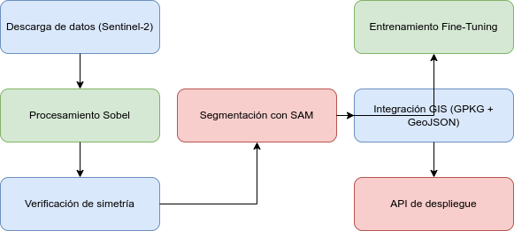

# Pilot Experimental: Agricultural Edge Detection 🌍

[](https://github.com/codelogman/experimental_pilot)
[](https://www.python.org/)
[](https://www.docker.com/)
[](https://kubernetes.io/)
[](https://www.jenkins.io/)
[](#)

This repository contains the scripts, analyses and configurations to develop a complete **agricultural edge detection** workflow using Sentinel-2 satellite imagery, **Automatic Segmentation Models (SAM)** and advanced geospatial analysis tools.


## Project Structure

```python
pilot_experimental/
├── dataset/ # Custom datasets for fine-tuning.
│   ├── train_annotations.json # Training annotations (COCO).
│   ├── train_images/ # Training images.
│   ├── val_annotations.json # Validation annotations (COCO).
│   └── val_images/ # Validation images.
├── notebook/ # Folder containing notebooks
│   └── dataset_construction.ipynb # Dataset construction flow.
├── analysis_statistics.html # Statistical analysis and metrics of the processed data.
├── api_prototype.py # API prototype for agricultural edge detection.
├── diagram.png # Diagram of the complete workflow.
├── Dockerfile # Dockerfile to containerize the flow.
├── final_check_integrity.py # Integrity check of generated files.
├── fine_tuning_sam.py # Fine-tuning of the SAM model.
├── generate_sobel_sentinel.py # Sobel processing of Sentinel images.
├── Jenkinsfile # Automated pipeline with Jenkins.
├── k8s-deployment.yaml # Deployment configuration on Kubernetes.
├── ndvi_evi_analysis.html # NDVI/EVI analysis.
├── ndvi_evi_visualization_map.html # Interactive NDVI/EVI map.
├── puppet-manifest.pp # Infrastructure management with Puppet.
├── sam_2_apply_colored2.py # SAM segmentation with GeoJSON/GPKG export.
├── sentinnel_download_script.py # Sentinel-2 image download.
├── tech_specs.txt # Technical specifications of the project.
├── test site.kml # Areas of interest defined in KML format.
├── unet_model.h5 # UNet model for future integrations.
└── check_symmetry.py # Spatial consistency check.```




## Features

**Preprocessing** of **Satellite** Images:


Interactive NDVI/EVI map generation.
Sobel processing for edge detection.

**Segmentation** and **Fine-Tuning**:

Fine-tuning of the SAM model with custom datasets.
RGBA mask generation exported in GeoJSON and GPKG formats.
Automation and Scalability:

Automated pipeline with Jenkins.
Ready-to-use configuration for Kubernetes and Puppet.

**Geospatial Analysis**:

Verification of spatial alignment between masks and original images.
Statistics and metrics exported in HTML format.

**API Prototype**:

RESTful service to integrate agricultural edge detection into external applications.

This project is open for contributions. For more details, check out [**tech_specs.md**](tech_specs.md)
``` bash
*alex_strange
```
